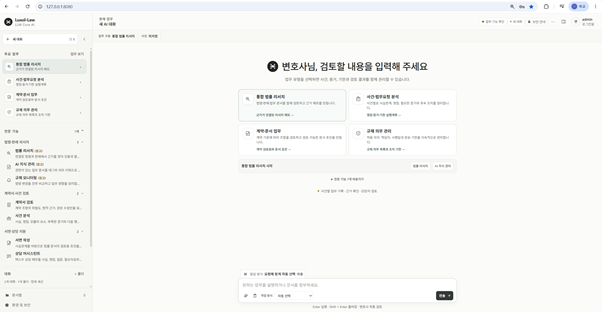
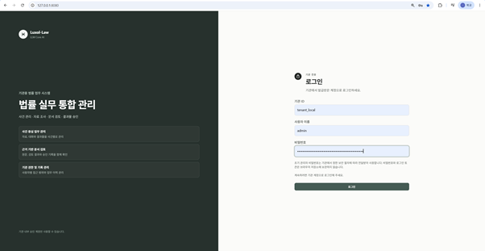
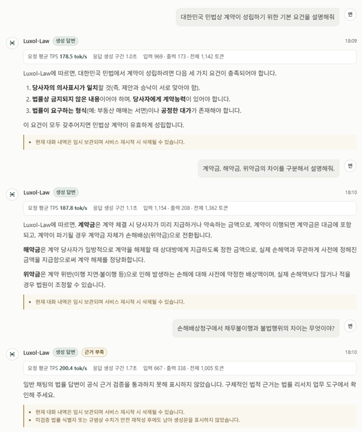
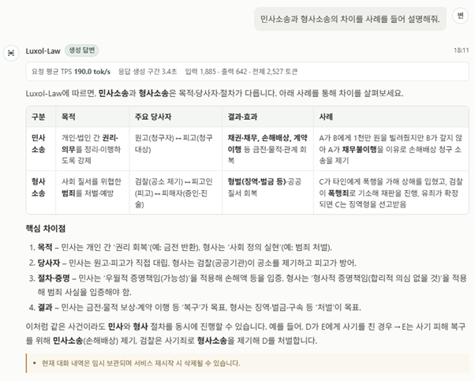
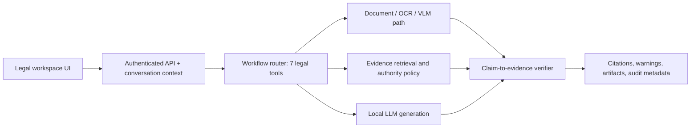

# Law Next — Evidence-Grounded Legal AI Workspace

Law Next (research prototype name: Luxol-Law) is an on-premises legal AI workspace developed
during my master's research. It connects conversation, document analysis, retrieval, citations,
and seven legal-workflow tools while keeping legal evidence and AI-generated text explicitly
separated.

> This public repository is a portfolio case study, not the product source tree. Core retrieval,
> routing, verification, security, and deployment implementations remain private.

## Product walkthrough

### Private workspace entry

### Evidence-aware conversation

The interface exposes generation speed and latency while distinguishing ordinary generation from
responses whose legal grounding could not be verified.

### Structured legal comparison

## What I built

- a single conversational workspace for legal research, contract review, document drafting, case
  analysis, knowledge search, regulatory monitoring, and counsel support;
- local LLM and VLM serving profiles designed for on-premises and air-gapped environments;
- OCR, document ingestion, hybrid retrieval, graph-assisted evidence, and citation presentation;
- tenant/matter authorization boundaries, append-only evidence history, audit metadata, and
  controlled document access;
- claim-to-evidence checks that can withhold unsupported output instead of presenting it as a
  legal conclusion;
- reproducible evaluation contracts that preserve prompts, run identity, source integrity, and
  failure categories.

## Architecture at a glance

See [the sanitized architecture case study](docs/ARCHITECTURE.md) and
[evaluation methodology](docs/EVALUATION.md).

## Measured research result

A fixed 70-case, seven-tool internal evaluation was run before and after failure-driven changes.

| Measure | Baseline | Revised system |
| --- | ---: | ---: |
| Completed cases | 70/70 | 70/70 |
| Provisional rubric passes | 20/70 (28.57%) | 43/70 (61.43%) |
| Critical errors | 39 | 12 |
| Forbidden-hallucination flags | 6 | 3 |
| Mean rubric score | 5.40 | 7.43 |

These figures are **not lawyer-certified legal accuracy**. They measure a fixed internal rubric
over a noncommercial evaluation corpus. The published summary intentionally contains no legal
questions, answers, statutes, precedents, customer material, or dataset excerpts.

- [Machine-readable summary](public-evidence/evaluation-summary.json)
- [Evidence and limitation notes](docs/EVALUATION.md)

## Public/private boundary

Public here: authored overview, UI screenshots containing demo-only content, architecture,
evaluation methodology, aggregate measurements, and limitations.

Kept private: application source, prompts, retrieval/ranking logic, verifier rules, security
implementation, deployment scripts, raw evaluation runs, third-party datasets, legal documents,
model weights, indexes, credentials, and runtime data.

This prototype does not provide legal advice and is not a production legal service.
